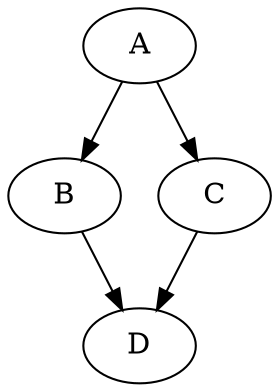

스벨트킷 블로그에 GraphViz로 그래프 그리는 방법을 정리했습니다.

## Graphviz 소개

[GraphViz](https://graphviz.org/)는 널리 쓰이는 그래프 렌더링 라이브러리입니다. 특히
`dot`이라는 언어가 유명한데요, 아래와 같이 dot 언어로 소스를 작성하면 이미지를 만들어 줍니다.



```render-dot
digraph G {
  A -> {B, C} -> D;
}
```

## 웹 브라우저에서 GraphViz 이용하기

GraphViz는 C 언어로 만들어져 있어서 브라우저에서 바로 사용할 수 없습니다. 하지만 웹어셈블리로
컴파일한 자바스크립트용 패키지인
[@hpcc-js/wasm](https://www.npmjs.com/package/@hpcc-js/wasm)이 있으니 그걸 쓰면 쉽게
해결할 수 있습니다.

CDN을 통해 동적 임포트를 사용할 예정이라 별도로 `npm install`을 하지는 않았습니다.

## 스벨트킷과 연동하기

아래와 같이 `render-dot` 코드 블럭을 만들면 이를 그래프로 바꿔주도록 하면 MDX 형식의 문서
안에서 쉽게 쓸 수 있으니 좋을 것 같아요.

```
\`\`\`render-dot
digraph G {
  A -> {B, C} -> D;
}
\`\`\`
```

`/src/lib/graphviz.ts` 파일을 생성하고 아래 내용을 작성했습니다.

```typescript
const DEFAULT_DOT = `digraph G {}`

export async function renderDot(el: HTMLElement) {
  // @ts-ignore: no type definition
  const hpcc = await import('https://cdn.jsdelivr.net/npm/@hpcc-js/wasm/dist/index.es6.js')
  hpcc.wasmFolder('https://cdn.jsdelivr.net/npm/@hpcc-js/wasm/dist/')

  const src = el.textContent || DEFAULT_DOT
  const newEl = document.createElement('div')
  newEl.classList.add('rendered-image')
  newEl.innerHTML = await hpcc.graphviz.layout(src, 'svg', 'dot')
  el.parentNode?.insertBefore(newEl, el)
}
```

`/components/LayoutDefault.svelte` 파일을 수정하여 위에서 작성한 코드를 연결했습니다.

```svelte
<script>
  import { renderDot } from '$lib/graphviz'
  import { onMount } from 'svelte'

  onMount(async () => {
    const els = [...document.querySelectorAll('pre.language-render-dot')]
    els.forEach(renderDot)
  })
</script>
```

하지만 이렇게 하면 렌더링된 그래프의 배경색이 이 블로그와 어울리지 않습니다. 배경색을 어둡게
바꾸고, 그래프 기본 전경색을 밝은 계열로 지정하도록 몇 가지 수정을 했습니다.

우선, `graphviz.ts`를 수정하여 모든 그래프의 기본 옵션에 해당하는 내용을 변수로 만듭니다.

```typescript
const GLOBAL_OVERRIDE = `
  bgcolor="transparent";
  node [color="#DDDDDD"; fontcolor="#DDDDDD"];
  edge [color="#DDDDDD"; fontcolor="#DDDDDD"];
`
```

같은 파일에서, 정규식을 이용하여 위 내용을 원래의 `dot` 소스 코드에 주입하도록 수정합니다.

```typescript
// 기존 코드
const src = el.textContent || DEFAULT_DOT

// 바뀐 코드
const src = (el.textContent || DEFAULT_DOT).replace(/^(.+?{)/s, `$1 ${GLOBAL_OVERRIDE}`)
```

마지막으로, CSS를 수정하여 컴포넌트의 배경색을 어두운 색으로 바꿨습니다.

```css
.rendered-image {
  overflow: auto;
  padding: 1.2rem 1.1rem;
  background-color: #1e1e1e;
}
```

## 소스코드

- 블로그 전체 [소스코드](https://github.com/gongbughim/blog)

## 관련 글

- [스벨트킷으로 블로그 만들기](/posts/sveltekit-blog)
